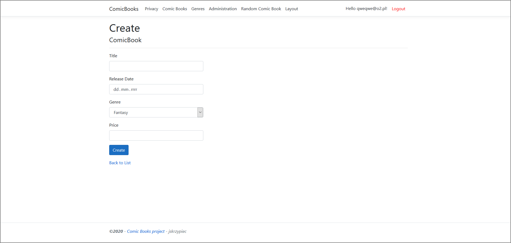
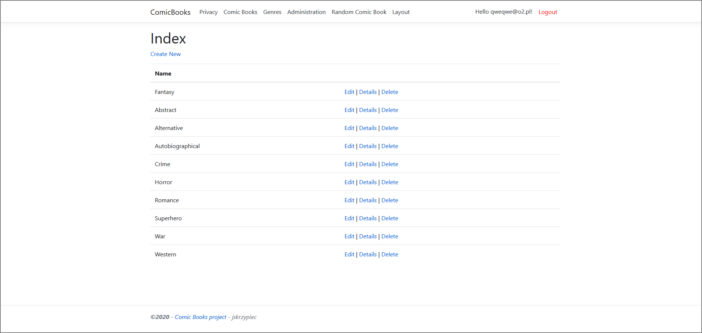
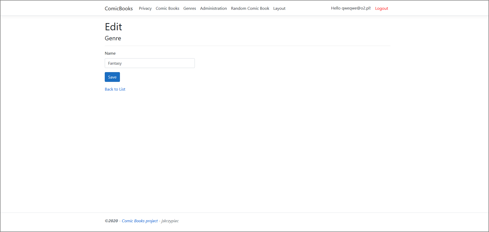

# Asp.Net2019
Projekt przygotowany w ramach zaliczenia kursu 'Technologie .NET' na Uniwersytecie Gdańskim w 2019 roku.
Projekt jest aplikacją Asp .NET MVC.

## About application
Ogólnym celem aplikacji jest zarządzanie komiksami (ComicBook) i ich gatunkami (Genre).  

Po uruchomieniu aplikacji ujrzymy stronę startową aplikacji:  

### Unregistered user - niezarejestrowany użytkownik
Domyślnie jesteśmy niezarejestrowanym użytkownikiem, czyli gościem na stronie.  
Gość na górnym pasku menu ma dostępne opcje:
- ComicBooks - przekierowanie do strony głównej
- Privacy
- Comic Books - lista komiksów (ComicBook)
- Genres - lista gatunków komiksów (Genre)
- Random Comic Book - losowo wybrany komiks
- Layout - customowy layout bez żadnej treści
- Register - panel rejestracji
- Login - panel logowania

#### Privacy
Domyślny komponent polityki prywatności (Private Policy)  

#### Comic Books - lista komiksów
Po przejściu do tego panelu zostanie wyświetlona lista komiksów.  
  

  

Opcje dostępne w tym komponencie:  
1. Dodanie nowego komiksu
2. Edycja danego komiksu
3. Wyświetlenie szczegółów danego komiksu
4. Usunięcie danego komiksu

Jednak dla niezalogowanego użytkownika z powyższych czterech dostępna jest opcja numer 3.  
Aby dodawać, edytować i usuwać komiksy należy zalogować się jako ADMINISTRATOR.  

Wyświetlenie szczegółów o wybranym komiksie:  
  

Próba dodania, edycji lub usunięcia komiksu przekieruje nas do panelu logowania.  

#### Genres - lista gatunków komiksów
Po przejściu do tego panelu zostanie wyświetlona lista gatunków komiksów.  
  

  

Opjce dostępne w tym panelu:
1. Dodanie nowego gatunku komiksów
2. Edycja danego gatunku komiksów
3. Wyświetlenie szczegółów danego gatunku komiksów
4. Usunięcie danego gatunku komiksów

Podobnie jak przy komiksach - dla niezalogowanego użytkownika z powyższych czynności dostępna jest 
jedynia ta z punku 3.  
Aby dodawać, edytować czy kasować gatunki komiksów należy zalogować się jako ADMINISTRATOR.

Wyświetlenie szczegółów o wybranym gatunku komiksów:  
  

Próba wykonania czynności opisanych w punktach 1,2,4 będzie skutkowała przekierowaniem do strony logowania.  

#### Random Comic Book - losowo wybrany komiks
Za każdym razem, gdy odwiedzimy tę podstronę zostaną nam wyświetlone szczegóły na temat wylosowanego komiksu 
(nazwa, id w bazie danych, data wydania, gatunek, cena).  

2 przykłady losowania:  
  

#### Layout - customowy layout strony
Zakładka, w której wspólny layout aplikacji został zastąpiony layoutem przygotowanym 'ręcznie' przeze mnie.  

#### Register - panel rejestracji
  

Umożliwia założenie nowego konta użytkownika po podaniu emaila oraz dwukrotnym powtórzeniu takiego samego hasła.  
Email musi być poprawnym adresem, a hasło musi składać się z 6-100 znaków.  

#### Login - panel logowania
Umożliwia zalogowanie się do serwisu na konto Użytkownika lub Administratora.  

### User - zalogowany użytkownik
Po rejestracji lub udanym logowaniu na konto Użytkownika jesteśmy zalogowanym Użytkownikiem.  

Strona startowa zalogowanego Użytkownika:  
  

Zalogowany użytkownik na górnym pasku manu ma dostępne opcje:
- ComicBooks - przekierowanie do strony głównej
- Privacy
- Comic Books
- Genres 
- Random Comic Book
- Layout
- Hello 'username' - zarządzanie kontem
- Logout - wylogowanie

Pierwsze 6 opcji jest identycznych jak u niezalogowanego użytkownika. W dwóch z nich jest jednak 
mała różnica - w zakładkach 'Comic Books' oraz 'Genres' przy próbie dodania, zmiany lub usunięcia pozycji 
z listy zostanie wyświetlony komunikat o odmowie dostępu (u niezalogowanego użytkownika następowało przekierowanie 
do strony logowania):  
  

Jak wspomniałem wczesniej przy omawianiu możliwości niezalogowanego użytkownika - możliwość dodawania, edycji, kasowania komiksów i ich 
gatunków ma wyłącznie zalogowany ADMINISTRATOR.  

#### Hello 'username'
Panel ten umożliwia zarządzanie swoim kontem. Możemy, np. dodać numer telefonu, zmienić email, zmienić hasło, skasować konto.  

  
  

#### Logout - wylogowanie
Zostaniemy wylogowani z naszego konta i jako niezalogowany użytkownik przekierowani do strony głównej aplikacji.  

  

### Admin - administrator
Po udanym logowaniu na konto Administratora jesteśmy zalogowanym ADMINISTRATOREM.  
Zalogowany Administrator ma dostęp do wielu funkcjonalności niedostępnych dla zwykłych Użytkowników czy 
też niezalogowanych Użytkowników.  

Strona startowa Administratora:  
  

Administrator na górnym pasku menu ma dostępne opcje:
- ComicBooks - przkierowanie do strony głównej
- Privacy
- Comic Books
- Genres 
- Administration - panel zarządzania rolami
- Random Comic Book
- Layout
- Hello 'username'
- Logout

Większość działa na tej samej zasadzie jak u zalogowanego Użytkownika. Opcja 'Administration' jest nowa, natomiast 
opcje 'Comic Books' oraz 'Genres' mają więcej funkcjonalności.  

#### Comic Books - lista komiksów
Po przejściu do tego panelu zostanie wyświetlona lista komiksów.  

  

  

Opcje dostępne w tym komponencie:  
1. Dodanie nowego komiksu  

  

Aby dodać nowy komiks należy podać:  
- nazwę (Title - długości od 3 do 100 znaków)
- datę wydania (Release Date)
- gatunek (Genre - wybór spośród istniejących gatunków komiksów w bazie danych)
- cenę (Price - liczbę z zakresu 1-200)

  

2. Edycja danego komiksu  

  

Edycja danych komiksu podlega tym samym zasadom, co dodawanie nowego komiksu - tzn. musimy podać:
- nową nazwę (Title - długości od 3 do 100 znaków)
- nową datę wydania (Release Date)
- nowy gatunek (Genre - wybór spośród istniejących gatunków komiksów w bazie danych)
- nową cenę (Price - liczbę z zakresu 1-200)  

Nie musimy zmieniać wszystkich danych o komiksie, możemy zmienić, np. jedynie nazwę. Aby to zrobić 
wystarczy podać nową nazwę w polu nazwy, a resztę danych zostawić z początkowymi wartościami.

3. Wyświetlenie szczegółów danego komiksu

Szczegóły przykładowego komiksu:  

  

4. Usunięcie danego komiksu

Jeżeli chcemy skasować komiks zostaniemy przekierowani do strony, która ma za zadanie potwierdzić naszą decyzję.  

  

Jeżeli definitywnie chcemy skasować komisk - potwierdzamy przyciskiem 'Delete', jeżeli nie - możemy wrócić do listy 
komiksów przyciskiem 'Back to List'.

#### Genres - lista gatunków komiksów
Po przejściu do tego panu zostanie wyświetlona lista gatunków komiksów.  

  

 

Opjce dostępne w tym panelu:
1. Dodanie nowego gatunku komiksów  

   

Aby dodać nowy gatunek komiksów należy podać jego nazwę (Name), która będzie długości od 3 do 56 znaków 
oraz będzie zawierała w sobie przynajmniej jedno wystąpienie jednej z trzech liter (a,o,e), a następnie 
potwierdzić dodanie nowego gatunku przyciskiem 'Create'.  

Walidacja nazwy przy tworzeniu nowego gatunku komiksów (genre):  
  
  

2. Edycja danego gatunku komiksów

  

Edycja istniejącego gatunku wygląda podobnie jak tworzenie nowego.  
Aby zmienić istniejący gatunek komiksów należy podać jego nową nazwę (Name), która będzie długości od 3 do 56 znaków 
oraz będzie zawierała w sobie przynajmniej jedno wystąpienie jednej z trzech liter (a,o,e), a następnie 
potwierdzić zmianę nazwy gatunku przyciskiem 'Save'. 

3. Wyświetlenie szczegółów danego gatunku komiksów

Szczegóły przykładowego gatunku komiksów:  

  

4. Usunięcie danego gatunku komiksów

Jeżeli chcemy usunąć gatunek komiksów zostaniemy przekierowani do strony, która ma za zadanie potwierdzić naszą decyzję.  

  

Jeżeli definitywnie chcemy skasować gatunek komiksów - potwierdzamy przyciskiem 'Delete', jeżeli nie - możemy wrócić do listy 
gatunków przyciskiem 'Back to List'.

#### Administration - panel zarządzania rolami
Jest to panel, do którego dostęp mają jedynie ADMINISTRATORZY. Panel umożliwia zarządzanie rolami użytkowników w serwisie.
Administrator może:
- przeglądać istniejące role
- dodać nową rolę
- edytować istniejącą rolę
- usunąć istniejącą rolę

Po przejściu do administracyjnego panelu zarządzania rolami zostanie nam wyświetlona lista ról istniejących w bazie danych.  

  

Dodawanie nowej roli:  

  

Aby dodać nową rolę musimy podać jej nazwę, a następnie zatwierdzić przyciskiem 'Create Role'.  

Edycja roli:  

  

Edytując rolę możemy zmienić jej nazwę - podając nową nazwę, po czym zatwierdzając przyciskiem 'Update'.  
Możemy również zarządzać Użytkownikami należącymi do danej roli po kliknięciu przycisku 'Add or remove users from this role'.  
Widok zarządzania użytkownikami w danej roli:  
  

Aby dodać użytkownika do roli, musimy zaznaczyć kwadrat obok jego emaila.  
Natomiast aby usunąć użytkownika z roli, musimy odznaczyć ten kwadrat.  
Zmiany możemy zatwierdzić przyciskiem 'Update' lub anulować przyciskiem 'Cancel'.

## Build With:
- ASP.NET
- Microsoft SQL Server

## Autor
- Jakub Skrzypiec (@jakub.skrzypiec - jakub.skrzypiec1@gmail.com)

